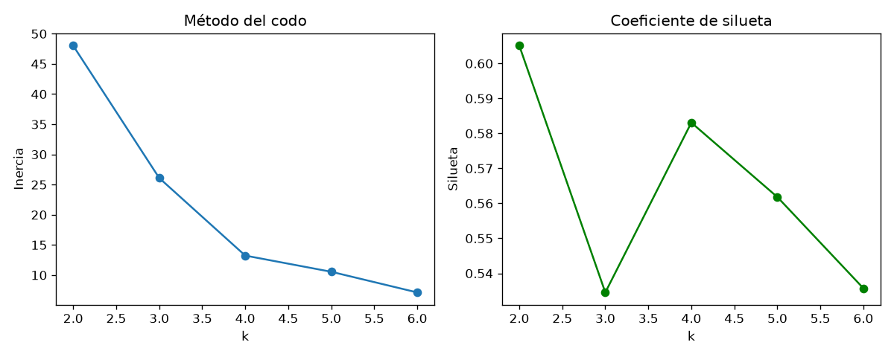
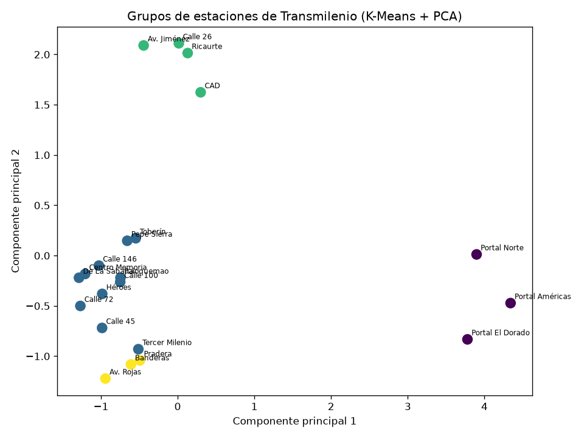

# Segmentación de Estaciones de Transmilenio con Aprendizaje No Supervisado

**Autor:**Santiago Hernandez - Sebastian Guevara
**Curso:** Inteligencia Artificial – Octavo semestre
**Universidad:**Universidad IberoAmericana

---

## 1. Descripción del proyecto

Este proyecto parte de un **sistema inteligente de rutas de Transmilenio** basado en reglas (`SistemaInteligente.py`), que calcula la mejor ruta entre dos estaciones a partir de hechos (conexiones y tiempos de viaje).

En esta entrega se agrega un modelo de **aprendizaje no supervisado**: se agrupan (*clustering*) las estaciones de la red según su comportamiento, **sin usar ninguna variable objetivo ni etiquetas previas**. El modelo descubre por sí solo qué tipos de estaciones existen.

### ¿Por qué es útil?

Conocer los tipos de estaciones permite apoyar decisiones operativas, por ejemplo, reforzar la flota en las estaciones de alta demanda o revisar los tramos largos entre estaciones de baja demanda.

| Elemento | Descripción |
|---|---|
| Tipo de aprendizaje | No supervisado |
| Tarea | Clustering (agrupamiento) |
| Algoritmo | K-Means |
| Selección de k | Método del codo y coeficiente de silueta |
| Visualización | PCA (reducción a 2 dimensiones) |
| Unidad de análisis | Una fila por estación (21 estaciones) |

---

## 2. Fuentes de datos

### 2.1 Fuentes reales identificadas

| Fuente | Entidad | Contenido relevante | Formato |
|---|---|---|---|
| Datos Abiertos Bogotá (datosabiertos.bogota.gov.co) | Alcaldía de Bogotá | Información de movilidad y transporte público | CSV / API |
| Datos abiertos de TransMilenio | TransMilenio S.A. | Validaciones y afluencia por estación, georreferenciación de estaciones y troncales | CSV / API |
| Portal de datos abiertos nacional (datos.gov.co) | Gobierno de Colombia | Conjuntos de datos de transporte y movilidad | CSV / API |
| Observatorio y datos de movilidad | Secretaría Distrital de Movilidad | Velocidades y tiempos de recorrido en corredores | CSV |

**Limitación encontrada:** estas fuentes aportan afluencia, ubicación y velocidades generales, pero no un conjunto de datos listo que combine, por estación, la afluencia, la participación de la hora pico y las características de la red (conexiones y tiempos a estaciones vecinas) que necesita este modelo.

### 2.2 Dataset desarrollado (`dataset_estaciones.csv`)

Se construyó un dataset de **21 estaciones** (una fila por estación), combinando datos derivados del proyecto con datos simulados:

| Columna | Origen | Descripción |
|---|---|---|
| `estacion` | Proyecto | Nombre de la estación (no se usa en el modelo) |
| `conexiones` | **Calculado** de los hechos | Número de estaciones conectadas directamente |
| `tiempo_prom_vecinas` | **Calculado** de los hechos | Tiempo promedio (min) a las estaciones vecinas |
| `es_portal` | **Derivado** del nombre | 1 si es portal, 0 si no |
| `afluencia_diaria` | **Simulado** | Pasajeros promedio por día |
| `pct_hora_pico` | **Simulado** | Proporción de la demanda diaria en hora pico |

> **Importante:** `afluencia_diaria` y `pct_hora_pico` son **datos simulados** (portales y estaciones de transbordo con mayor demanda que las intermedias, más ruido aleatorio). No son mediciones reales de Transmilenio. Los resultados demuestran el método, no el comportamiento real de la red.

El dataset **no tiene variable objetivo**, que es lo que caracteriza el aprendizaje no supervisado.

---

## 3. Estructura del repositorio

```
├── SistemaInteligente.py            # Sistema de rutas basado en reglas
├── clustering_transmilenio.py       # Dataset, K-Means, evaluación y gráficas
├── dataset_estaciones.csv           # Dataset de 21 estaciones
├── estaciones_agrupadas.csv         # Resultado: cada estación con su grupo
├── grafica_codo_silueta.png         # Selección del número de grupos
├── grafica_grupos_pca.png           # Visualización de los grupos
├── requirements.txt                 # Dependencias
└── README.md
```

---

## 4. Cómo ejecutarlo

**Requisitos:** Python 3.9 o superior.

```bash
# 1. Clonar el repositorio
git clone [URL_DEL_REPOSITORIO]
cd [NOMBRE_DEL_REPOSITORIO]

# 2. Instalar dependencias
pip install -r requirements.txt

# 3. Ejecutar el modelo de clustering
python clustering_transmilenio.py
```

El script construye el dataset, imprime estadísticas y métricas, y guarda los CSV y las gráficas.

---

## 5. Metodología

1. **Construcción del dataset** a partir de los hechos del proyecto y variables de demanda simuladas.
2. **Exploración:** estadísticas descriptivas y revisión de valores nulos (no hay).
3. **Preprocesamiento:** estandarización con `StandardScaler`. K-Means se basa en distancias, y sin escalar, la afluencia (decenas de miles) dominaría sobre las demás variables.
4. **Selección del número de grupos (k):** se evalúa k de 2 a 6 con el método del codo (inercia) y el coeficiente de silueta.
5. **Modelo final:** K-Means con el k elegido.
6. **Interpretación:** perfil promedio de cada grupo y estaciones que contiene.
7. **Visualización:** PCA para proyectar las 5 variables a 2 dimensiones.
8. **Inferencia:** el modelo asigna un grupo a una estación nueva.

### Sobre la elección de k

| k | Inercia | Silueta |
|---|---|---|
| 2 | 48.02 | 0.605 |
| 3 | 26.10 | 0.535 |
| 4 | 13.24 | **0.583** |
| 5 | 10.55 | 0.562 |
| 6 | 7.13 | 0.536 |

Con k = 2 la silueta es la más alta, pero esa agrupación solo separa los 3 portales del resto de la red, lo cual aporta poco. Por eso se exige **al menos 3 grupos** y, entre ellos, se elige el de mejor silueta: **k = 4**.

---

## 6. Resultados

Variables usadas: `conexiones`, `tiempo_prom_vecinas`, `es_portal`, `afluencia_diaria` y `pct_hora_pico`.

| Grupo | Estaciones | Perfil |
|---|---|---|
| **0 – Portales** | Portal Norte, Portal Américas, Portal El Dorado | Mayor afluencia (~35.800/día) y mayor concentración en hora pico (~47 %) |
| **1 – Intermedias** | Toberín, Calle 146, Pepe Sierra, Calle 100, Héroes, Calle 72, Calle 45, Tercer Milenio, De La Sabana, Centro Memoria, Paloquemao | Demanda baja (~12.200/día) y tramos cortos |
| **2 – Transbordo** | Calle 26, Av. Jiménez, Ricaurte, CAD | 3 conexiones y demanda alta (~28.500/día) |
| **3 – Tramos largos** | Pradera, Banderas, Av. Rojas | Demanda baja (~11.300/día) y tiempos largos a las estaciones vecinas (5.5 min) |

- **Coeficiente de silueta:** 0.583 con k = 4.
- **Varianza explicada por PCA (2 componentes):** 78.2 %.
- **Estación nueva de ejemplo** (3 conexiones, 28.000 pasajeros/día, 40 % en hora pico): el modelo la asigna al **grupo 2 (transbordo)**.

### Gráficas




En la proyección PCA, los portales y las estaciones de transbordo quedan claramente separados del resto. El grupo de tramos largos queda cerca del de estaciones intermedias, ya que se diferencian principalmente por una sola variable (el tiempo a las vecinas).

---

## 7. Conclusiones y limitaciones

- K-Means identificó una segmentación coherente con la lógica de la red (portales, transbordos, intermedias y tramos largos) sin necesidad de etiquetas previas.
- **Limitación principal:** la demanda es simulada y se generó con diferencias marcadas entre tipos de estación, por lo que los grupos salen más nítidos de lo que serían con datos reales.
- **Limitación adicional:** con solo 21 estaciones, el resultado es sensible al número de grupos elegido y a las variables incluidas.
- **Trabajo futuro:**
  - Reemplazar la demanda simulada por datos reales de validaciones por estación.
  - Incorporar más variables (variación por franja horaria, ubicación geográfica).
  - Probar otros algoritmos de clustering (clustering jerárquico, DBSCAN) y comparar resultados.
  - Usar los grupos para ajustar la frecuencia de buses en el sistema de rutas.

---

## 8. Tecnologías

Python · pandas · numpy · scikit-learn · matplotlib
